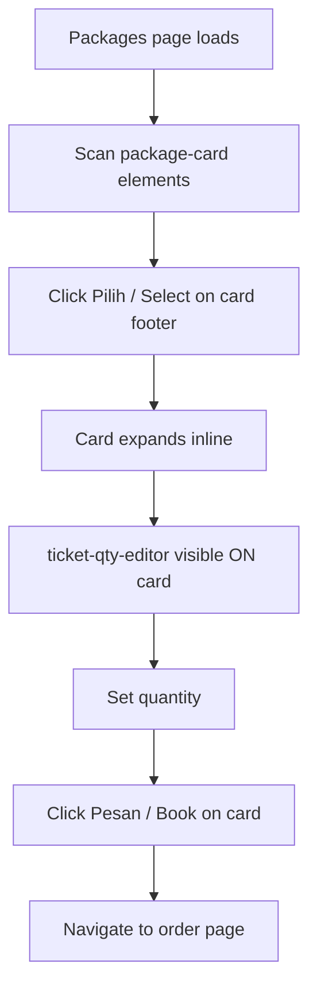
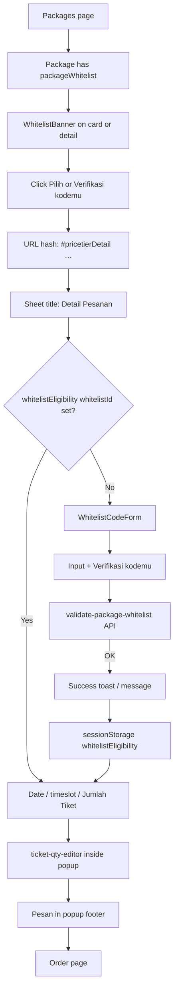

# Tiket packages: general sale vs membership / presale

How tiket.com distinguishes membership-gated packages from general sale, and what the user (or autobuy extension) must do differently.

## Stack (context)

- **Next.js Pages Router** — not App Router / RSC
- Initial HTML is a shell; package list is fetched client-side after hydration
- UI strings are bundled in the main app chunk (`_app-*.js`), Indonesian + English — not fetched remotely at runtime
- Package-specific presale copy (e.g. artist presale banner text) comes from the **inventory API** on each package

Route: `/to-do/[slug]/packages`

---

## Data model: the one flag that matters

Each package object from inventory may include:

```ts
packageWhitelist: {
  whitelistId: string
  translations: Array<{
    bannerTitle: string  // shown in WhitelistBanner — often event-specific presale copy
    // ...
  }>
} | null | undefined
```

| Condition                        | Flow                                                                                 |
| -------------------------------- | ------------------------------------------------------------------------------------ |
| `packageWhitelist` absent / null | **General sale** — inline card expand, qty on card, book on card                     |
| `packageWhitelist` present       | **Membership / presale** — code gate inside **Detail Pesanan** popup before qty/book |

Membership packages are also **sorted later** in the list (after loyalty-gated packages). In bundled code, search for `packageWhitelist` near list-sort logic.

---

## General sale flow

Everything happens on the **package card** on the packages page. No modal required.



**Current extension behavior** (`flow-packages.ts`):

1. Find `[data-testid="package-card"]`
2. Click **Pilih** in `[data-testid="package-card-footer"]`
3. Wait for `input[type="number"]` and `[data-testid^="ticket-qty-editor-"]` on the **same card**
4. Increment qty, click **Pesan** on the **same card**

No whitelist API, no session storage gate, no hash popup.

---

## Membership / presale flow

Gated packages still appear on the same packages page, but booking goes through a **hash-routed bottom sheet / modal** titled **Detail Pesanan**, with a **code verification step first**.



### UI copy (bundled i18n, Indonesian)

Namespace: `pages.pricetier.*` — search the app bundle (`_app-*.js`) for these keys or their Indonesian string values.

| i18n key                          | Indonesian UI                                                    |
| --------------------------------- | ---------------------------------------------------------------- |
| `headerTitle`                     | **Detail Pesanan**                                               |
| `whitelistCode.title`             | **Masukkan kodemu**                                              |
| `whitelistCode.inputLabel`        | **Kode keanggotaan fan club**                                    |
| `whitelistCode.submitBtn`         | **Verifikasi kodemu**                                            |
| `whitelistCode.success`           | **Hore! Kamu bisa membeli paket khusus ini!**                    |
| `whitelistCode.errorMsg.notFound` | Kode tidak terdaftar. Yuk, coba lagi!                            |
| `whitelistCode.errorMsg.redeemed` | Kode sudah dipakai di transaksi lain.                            |
| `whitelistBanner.title`           | Paket ini butuh kode keanggotaan                                 |
| `whitelistBanner.description`     | Untuk membeli paket ini, kamu wajib memasukkan kode keanggotaan. |

Footer labels (`pages.packageDetail.footerPackageDetail.*`):

| State                           | Button text (ID)                |
| ------------------------------- | ------------------------------- |
| Whitelist package, not verified | **Verifikasi kodemu**           |
| Whitelist package, verified     | **Pilih tiket**                 |
| General package                 | **Pilih tiket**                 |
| Ready to book                   | **Pesan** (in pricetier footer) |

**Artist / presale-specific wording** (e.g. “kode artist presale”) is **not** in bundled i18n. It appears as `packageWhitelist.translations[0].bannerTitle` from the API, rendered in `WhitelistBanner`.

### Code verification API

Stable path (search bundles or Network tab to confirm):

```
GET /tix-events-v2-inventory/v1/products/{productId}/packages/{packageCode}/validate-package-whitelist?code={whitelistCode}
```

Returns 429 on rate limit.

### Verified state (client)

Zustand store persisted to **sessionStorage**. Search bundled code for `whitelistEligibility` and `setWhitelistEligibility`:

```ts
whitelistEligibility: {
  [whitelistId: string]: verifiedCodeString
}
```

- `setWhitelistEligibility(whitelistId, code)` — after successful API validation
- `removeWhitelistId(whitelistId)` — on leave / reset

Footer / book button logic (simplified — names survive minification better than file locations):

```js
const whitelistId = package.packageWhitelist?.whitelistId
const verified = whitelistEligibility[whitelistId]

// Footer label on package detail
if (whitelistId) {
  label = verified ? "selectTicket" : "verifyYourCode"
}

// Pricetier sticky footer — no Pesan until verified
if (hasWhitelist && !isWhitelistEligible) return null
```

A `TODO_WHITELIST_CODES` localStorage constant may appear in the app bundle, but the active gate we observed uses **`whitelistEligibility` in sessionStorage**. Verify on the build you are targeting.

### Leave confirmation

If user closes the sheet before finishing, i18n offers a dialog (`whitelistCode.dialogConfirmation`):

- Title: _Yakin mau keluar dari halaman ini?_
- Description: _Menutup halaman ini berarti kamu harus mengisi ulang kode khusus sebelumnya._

---

## Side-by-side summary

|                      | General sale          | Membership / presale                          |
| -------------------- | --------------------- | --------------------------------------------- |
| API field            | no `packageWhitelist` | `packageWhitelist.whitelistId` + translations |
| Primary surface      | Package card (inline) | `#pricetierDetail` popup                      |
| First user action    | Pilih → expand card   | Open sheet → verify code                      |
| Qty editor location  | On card               | Inside popup (after verify)                   |
| Book button location | On card footer        | Popup sticky footer                           |
| Pre-book gate        | None                  | API + sessionStorage                          |
| Extension today      | Implemented           | **Not implemented**                           |

---

## Autobuy implications

For membership packages, `flow-packages.ts` must branch **before** assuming inline qty on the card:

1. Detect whitelist package (banner, or footer **Verifikasi kodemu**, or `#pricetierDetail` after click)
2. Open / wait for **Detail Pesanan** sheet
3. Fill membership code (from customer pool / `membershipCode` fixture field)
4. Click **Verifikasi kodemu**, wait for success
5. Set quantity inside the popup (`ticket-qty-editor-*`)
6. Click **Pesan** in popup footer — not on the card

See [tiket-packages-dom.md](./tiket-packages-dom.md) for selectors and DOM shape.

---

## Where logic lives in the bundle (search, don’t memorize paths)

Webpack splits code into hashed files that **change every deploy**. Use ripgrep over a fresh download; typical **symbols** and what they indicate:

| Search for                                         | Usually indicates                 |
| -------------------------------------------------- | --------------------------------- |
| `validate-package-whitelist`                       | Inventory API client              |
| `whitelistEligibility` / `setWhitelistEligibility` | Session gate store                |
| `WhitelistCodeForm`                                | Code input UI (often lazy-loaded) |
| `WhitelistBanner`                                  | Presale banner component          |
| `PACKAGE_DETAIL_POPUP` / `PRICETIER_DETAIL`        | Hash-route enum names             |
| `#pricetierDetail` / `#packageDetailPopup`         | DOM hash anchors                  |
| `package-card` / `ticket-qty-editor`               | `data-testid` values              |
| `pages.pricetier.whitelistCode`                    | i18n namespace                    |
| `_app-` (filename pattern)                         | Main app chunk with all locales   |

Lazy-loaded pieces (`WhitelistCodeForm`, full package card UI) may be missing from a “Save Page” dump — fetch from the live CDN using the current `webpack-*.js` map. See [tiket-reverse-engineering.md](./tiket-reverse-engineering.md).
