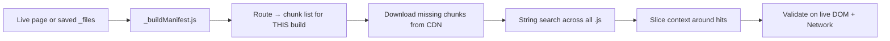

# Reverse-engineering tiket.com Next.js bundles

How to explore minified production JS when source maps are unavailable.  
Applies to any tiket **to-do** deploy — do not rely on memorized chunk filenames.

---

## What changes vs what stays stable

| Changes every deploy                        | Usually stable                                         |
| ------------------------------------------- | ------------------------------------------------------ |
| Chunk filenames (`NNNN-<hash>.js`)          | API path strings                                       |
| Webpack numeric module IDs                  | `data-testid` values                                   |
| CSS module suffixes (`__abc123`)            | Hash DOM ids (`#pricetierDetail`)                      |
| CDN path version segment (`/to-do/vX.Y.Z/`) | i18n key paths (`pages.pricetier.whitelistCode`)       |
| Which chunk holds a given symbol            | Symbol names (`packageWhitelist`, `WhitelistCodeForm`) |

Strategy: **search by string**, then read context. Never assume “the whitelist store is in file X” from an old doc.

---

## What you are working with

| Fact                         | Implication                                                                  |
| ---------------------------- | ---------------------------------------------------------------------------- |
| Next.js **Pages Router**     | Route chunks under `_next/static/chunks/pages/…` plus numbered shared chunks |
| **No published source maps** | `.map` URLs 404; read minified code or search strings                        |
| **i18n in app bundle**       | File matches `_app-*.js`; all UI strings searchable as plain text            |
| **Lazy loading**             | Key UI often not in initial “Save Page” download                             |
| **API paths as strings**     | `/tix-events-v2-inventory/...` survive minification                          |

CDN pattern (replace version from live page):

```
https://assets-bucket.tiket.com/to-do/<VERSION>/_next/static/chunks/<filename>
```

Get `<VERSION>` from script URLs on a live packages page (e.g. `v2.99.0` — will change).

---

## Workflow overview



---

## Step 1: Confirm stack

On live HTML or saved page scripts:

```bash
curl -sI -A 'Mozilla/5.0' 'https://www.tiket.com/en-id/to-do/…/packages' | grep -i next
```

Look for:

- `__NEXT_DATA__` — Pages Router bootstrap
- `_next/static/chunks/pages/…/packages-*.js` — route entry (hash in filename changes)
- Absence of `__next_f.push`, `react-server-dom-*` — not RSC

---

## Step 2: Route → chunks for **this** build

In saved `_files/_buildManifest.js`, find the route key:

```js
"/to-do/[slug]/packages": [ … chunk filenames … ]
```

That array is the **only** authoritative list of chunks for the packages page on that deploy. Filenames differ every release.

Download any missing entries from the CDN using the same `<VERSION>` as the saved assets.

---

## Step 3: String search (primary technique)

Search all `.js` in your dump — do not read whole bundles by hand.

```bash
DIR="/path/to/tiket.com_files"
rg -l 'validate-package-whitelist|packageWhitelist|whitelistEligibility' "$DIR" --glob '*.js'
```

High-value needles:

| String                                      | Usually means                     |
| ------------------------------------------- | --------------------------------- |
| `validate-package-whitelist`                | API client                        |
| `packageWhitelist`                          | Data model + UI branches          |
| `whitelistEligibility`                      | sessionStorage gate               |
| `WhitelistCodeForm`                         | Code input component (often lazy) |
| `WhitelistBanner`                           | Presale banner                    |
| `PACKAGE_DETAIL_POPUP` / `PRICETIER_DETAIL` | Hash-route enum names             |
| `#pricetierDetail` / `#packageDetailPopup`  | DOM hash anchors                  |
| `package-card`                              | Card `data-testid`                |
| `ticket-qty-editor`                         | Qty widget `data-testid`          |
| `Masukkan kodemu` / `Verifikasi kodemu`     | i18n plain text in app bundle     |
| `footerPackageDetail`                       | Package footer CTA labels         |

The **file that matches** is build-specific. The **string** is what you document.

### Extract i18n from the app bundle

Find the app chunk: `ls _app-*.js` or `rg -l 'Masukkan kodemu' .`

```bash
node <<'NODE'
const fs = require('fs')
const app = fs.readdirSync('.').find(f => f.startsWith('_app-') && f.endsWith('.js'))
const s = fs.readFileSync(app, 'utf8')
const i = s.indexOf('Masukkan kodemu')
console.log(s.slice(i - 800, i + 1500))
NODE
```

Namespace for membership UI: `pages.pricetier.whitelistCode`, `pages.pricetier.headerTitle`, etc.

---

## Step 4: Context extraction around a hit

Minified code is often one line. Slice around the match in **whatever file rg returned**:

```bash
node <<'NODE'
const fs = require('fs')
const file = process.argv[1]   // pass the file from rg
const term = 'validate-package-whitelist'
const s = fs.readFileSync(file, 'utf8')
const idx = s.indexOf(term)
console.log(s.slice(Math.max(0, idx - 400), idx + 800))
NODE
# usage: node script.js path/to/matching-chunk.js
```

Repeat for each occurrence. Look for:

- Function parameters (`productId`, `packageCode`, `whitelistCode`)
- Click handlers (`onClick`, `useCallback`)
- `switchHashKey`, dialog type enums
- `sessionStorage` + persist middleware

---

## Step 5: Lazy-loaded modules

Large UI pieces are loaded via `import()` / `Promise.all([...t.e(chunkId)...])`.

**Do not memorize module numbers** — they change per build.

Process:

1. Search for a component name, e.g. `WhitelistCodeForm`
2. Find the nearby `import(` / `t.bind(t, MODULE_ID)` / `loadableGenerated`
3. Note webpack **chunk IDs** in the same expression (numeric, build-specific)
4. Parse **`webpack-*.js`** from the **same** saved page to map chunk ID → filename:

```bash
node <<'NODE'
const fs = require('fs')
const webpack = fs.readdirSync('.').find(f => f.startsWith('webpack-') && f.endsWith('.js'))
const s = fs.readFileSync(webpack, 'utf8')
const map = {}
for (const m of s.matchAll(/(\d+):"([a-f0-9]+)"/g)) map[m[1]] = m[2]
// Pass chunk IDs you found in step 2:
;[590, 2423, 3266].forEach(id =>
  console.log(id, map[id] ? `${id}-${map[id]}.js` : 'not in map'))
NODE
```

5. Download those files from CDN and search again.

**Caveat:** Some IDs in the map point at CSS, not JS. If CDN returns 404, re-check you are on the same deploy as the saved `webpack-*.js`.

---

## Step 6: Optional beautify

For a single chunk you are drilling into:

```bash
npx --yes js-beautify ./matching-chunk.js -o /tmp/chunk.pretty.js
rg 'whitelistEligibility|setWhitelistEligibility' /tmp/chunk.pretty.js
```

Avoid prettifying the entire `_app-*.js` — use targeted slices instead.

---

## Step 7: Map symbols → behavior

| Pattern in bundle                        | Document as                  |
| ---------------------------------------- | ---------------------------- |
| `"/tix-events-v2-inventory/..."`         | API endpoint                 |
| `data-testid:"..."`                      | DOM selector                 |
| `#pricetierDetail` / `PRICETIER_DETAIL`  | Hash / navigation            |
| `pages.pricetier.*`                      | User-visible copy (i18n key) |
| `sessionStorage` + persist               | Client state                 |
| `packageWhitelist`                       | Branch condition             |
| React component name (`WhitelistBanner`) | UI area (verify in DOM)      |

Update [tiket-packages-flow.md](./tiket-packages-flow.md) and [tiket-packages-dom.md](./tiket-packages-dom.md) when you confirm new **stable** hooks — not chunk filenames.

---

## Step 8: Validate on live DOM + Network

Bundled code shows intent; the browser shows truth.

1. Open packages page with DevTools
2. **General package:** Pilih → inspect card for `ticket-qty-editor-*`
3. **Whitelist package:** open Detail Pesanan → inspect sheet, input, footer
4. Network: filter `validate-package-whitelist` on verify click
5. Application → Session Storage: search for persist key containing `whitelistEligibility` (exact key name may vary — search storage for a verified code string after manual test)

Saved “Web Page, Complete” dumps often lack lazy chunks and popup DOM.

---

## Tools cheat sheet

```bash
# Which files contain a symbol? (output filenames are build-specific)
rg -l 'packageWhitelist' /path/to/_files --glob '*.js'

# Count hits per file
node -e "
const fs=require('fs'), t='packageWhitelist'
fs.readdirSync('.').filter(f=>f.endsWith('.js')).forEach(f=>{
  const n=(fs.readFileSync(f,'utf8').match(new RegExp(t,'g'))||[]).length
  if(n) console.log(f,n)
})"

# Find app bundle dynamically
ls _app-*.js 2>/dev/null || rg -l 'Masukkan kodemu' . --glob '*.js' | head -1
```

---

## Pitfalls

| Pitfall                                | Mitigation                                                                           |
| -------------------------------------- | ------------------------------------------------------------------------------------ |
| Copying chunk filenames from old notes | Search by symbol; use `_buildManifest` for current build                             |
| Assuming remote i18n                   | Search `_app-*.js`; presale **banner** text is API `bannerTitle`                     |
| Trusting saved HTML only               | Lazy components missing; fetch CDN chunks                                            |
| `TODO_WHITELIST_CODES` in app bundle   | May be legacy; confirm active store via `whitelistEligibility` + live sessionStorage |
| Inline qty on whitelist cards          | Qty is in pricetier sheet after verify                                               |
| Source maps                            | Not published                                                                        |
| CSS module class names                 | Prefer `data-testid`, roles, and visible i18n text                                   |

---

## When tiket deploys a new version

1. Note new version segment in script URLs
2. Re-save page or re-download `_buildManifest.js` + `webpack-*.js`
3. Re-run symbol searches (`validate-package-whitelist`, `packageWhitelist`, `ticket-qty-editor`)
4. Diff i18n strings if button labels changed
5. Re-verify DOM on live page — testids change more often than API paths, but less often than chunk hashes
